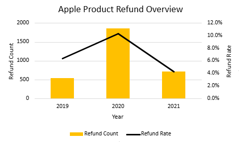

# NexTech Direct Analysis
## Client Background
NexTech Direct is a US-based e-commerce retailer that specializes in consumer electronics. Operating across multiple major regions globally, the company sells a variety of popular electronics, while running a loyalty program aimed at driving repeat purchases and long-term customer retention. This analysis will be covering NexTech Direct’s underutilized data of sales performance, refund trends, and loyalty program effectiveness from 2019 to 2022.

## Business Questions
**What were the overall trends in sales from 2019-2022?**
- What were the monthly and yearly order counts, AOV, and total revenue throughout this period?
- How did sales performance differ by month and region? and any seasonality?
- Which products performed the best and worst?

**Should NexTech continue investing in its loyalty program?**
- Did loyalty members generate higher AOV compared to non-members?
- Did loyalty members order more frequently?
- How did loyalty membership and its revenue share evolve between 2019 and 2022?
- How was loyalty membership distributed across regions and products?
- What was the refund behavior of loyalty members vs. non-members

**What were the refund trends across Apple products?**
- What were the overall refund rates and refund counts for Apple products?
- Did refund behavior change year over year?

# Key Insights
## Sales Overview
From 2019-2022, just over 108k total orders generated $28M in gross revenue over this 4-year timespan. A key year was 2020, when a spike in sales led to a 160% increase in revenue year-over-year and a 2x growth in order volume, driven by increased online consumer demand amidst the COVID-19 pandemic. However, this momentum proved to be unsustainable through 2021-2022 with key metrics showing decreases year-over-year: total revenue by 46%, order volume 40%, and average order value (AOV) by 10%. While this decline can be linked to society slowly coming out of lockdown, the next sections will be diving into other contributing factors and point out potential areas that could be improved upon.

  

### Seasonality and Geography

  

Monthly revenue followed a consistent seasonal pattern across the period, with Q4 generally representing the strongest stretch of each year driven by holiday demand, and Q1 showing relative pullback before sales stabilized through the mid-year. 2020 was the clear outlier, with revenue accelerating from March onward as COVID-driven online consumer demand pushed monthly figures well above anything seen in the year prior, peaking at $1.25M in December. 2021 maintained elevated levels relative to 2019 but trended downward throughout the year, and 2022 followed a similar trajectory before dropping sharply in Q4, which could point to the potential for incomplete data for that period rather than an organic seasonal shift.

  

Regionally, NA was the dominant market across all four years, accounting for roughly $14.5M of the $28M in total revenue, with EMEA as a distant second at $8.2M. APAC and LATAM remained comparatively small contributors throughout the period. All four regions mirrored the same 2020 spike and post-2021 decline, suggesting the broader demand trends were global in nature rather than driven by any single market.

### Product Trends
The company's catalog was anchored by 4 primary products: Gaming Monitors, Laptops, AirPods, and Charging Cables, which together accounted for over 97% of the revenue and over 89% of the order volume across all 4 years. A clear revenue-volume disconnect emerged between Laptops and Charging Cables specifically, as the Laptops consistently contributed a disproportionately high share of revenue (26-42%) relative to their order volume (4-9%), reflecting their high price point and positioning them as a low-frequency, high-AOV product. 

  

On the other hard, Charging Cables showed the opposite pattern with a notably higher share of order volume (17-26%) than revenue (1-3%), marking them as a high-frequency, lower-AOV product. Gaming Monitors and AirPods kept a steady and consistent contributors in both areas throughout the timeframe, while the Other category saw gradual uptick in revenue and volume by 2022, hinting at a slow shift towards the less mainstream products.

  

## Loyalty Program
### Member Value
Across all 3 core sales metrics: average order value (AOV), total revenue, and order volume, loyalty member show a clear and accelerating value advantage over the period of 2019-2022.

  

In 2019, loyalty membership had very minimal effects as they represented only 2K orders and $415K in total revenue. This being compared to their non-loyalty counterparts with 14.8K orders and $3.45M, even outpacing AOV with $233 (non-members) versus $207 (members). As expected, the program started off small and its members were not yet outspending the broader customer base.

  

By 2021, the program had enough time to scale, with second-order effects beginning to emerge. Loyalty revenue ($4.87M) surpassed non-loyalty revenue ($4.26M) for the first time, and order volume followed the same trend with 19.5K member orders versus 16.3K non-member. This crossover across revenue and volumes signals that the program reached a meaningful inflection point, shifting loyalty members from a small minority to a dominant contributor of NexTech Direct's sales. 

  

The AOV trajectory reinforces this narrative, non-loyalty AOV peaked in 2020 at $345 before declining to $214 by 2022, while loyalty AOV grew steadily from $207 to $249 before settling at $245 in 2022, finally surpassing non-loyalty for the first time. All core metrics show that members are not only ordering more frequently, but they are even spending more per order.

### Program Growth & Distribution
Between 2019 and 2022, the loyalty program went through a transformation from a marginal asset to the majority catalyst of NexTech Direct's revenue. In 2019, loyalty members accounted for just 11% of total revenue. By 2021 the figure had ballooned to 53%, holding steady at 55% through 2022, thus showing that the program is proving to be a reliable assest rather than a simple one-year anomaly.

  

The program's reach was consistent across all four major regions. APAC, EMEA, LATAM, and NA all fell within a narrow 37-41% loyalty share band, with no specific region standing out amongst the others. This uniformity is a positive signal showing that the program's growth was organic and spread out evenly rather than concentrated in one market.

  

At the product level, loyalty share turned out to be fairly more volatile. AirPods carried the highest loyalty concentration at 56%, followed by Gaming Monitors at 43%. Laptops showed a notable loyalty share at a low 22%, which could be worth monitoring knowing they are NexTech's highest AOV-product. Charging Cables sat at just 14% loyalty share, which is consistent with their low-cost, high-volume nature as a product.

  

### Loyalty Refund Behavior
While loyalty members demonstrated positive purchasing behavior across AOV, volume, and revenue contribution, their refund rates consistently surpass those of non-members throughout the 2019-2022 period. In 2019, loyalty members refunded at 7.8% compared to 5.4% for the non-members. That gap widened significantly in 2020, where loyalty refund rates peaked at 12.9% versus 6.9% for non-loyalty, nearly double. By 2021 both segments declined, with loyalty at 5.1% and non-loyalty at 1.8%.

  

It's worth noting that the 2019 loyalty refund rate is based on a relatively small sample size, reflecting how nascent the membership program still was at that point. As membership scaled through 2020 and 2021, order volumes between segments became more comparable, making the rate gaps in those years the most meaningful signals in the data. The raw refund counts tell the same story, where loyalty refunds grew from roughly 150 in 2019 to over 1,600 in 2020, while non-loyalty refunds grew more modestly from roughly 800 to 1,400 over the same period. This elevated refund behavior among loyalty members is a nuance worth monitoring but not a disqualifying finding. Loyalty members still generate higher AOV and greater revenue contribution even accounting for returns, suggesting the net value of the program remains positive.

  

## Apple Refunds
### Refund Overview

  

Apple product refunds peaked significantly in 2020, with the overall refund rate climbing from 6.4% to 10.3% and refund count nearly tripling from 545 to 1,853. This pattern correlates with COVID-era consumer behavior, where supply chain disruptions and shifting purchase decisions drove increased return activity across retail. By 2021, both metrics had fallen well below their 2019 baseline, suggesting the spike was situational rather than structural.

### Product Refund Behavior

  

At the product level, MacBooks carried the highest refund rates across all three years, starting at 18.3% in 2019 before dropping to 6.3% by 2021. Given their ~$1,600 AOV, MacBook refunds represent a disproportionate revenue impact relative to their count. 67 refunds in 2019 and 311 in 2020 translate to significantly more lost revenue than AirPods' 473 and 1,529 respectively. AirPods dominated refund volume by count due to their sales scale, while iPhone refund counts remained negligible across the entire period. Across all three products, the 2020 spike and 2021 recovery held consistent, reinforcing that the elevated refund activity was driven by external conditions rather than product-specific issues.

  

## Recommendations
### Sales Performance
- Investigate the sharp Q4 2022 revenue drop before attributing it to an organic seasonal shift. Incomplete data for that period could be the likely culprit and worth confirming before drawing conclusions.
- Consider stategies to reverse post-COVID decline, particularly in high-AOV product lines like Laptops, which saw the steepest proportional revenue loss.
- Lean into Q4 demand concentration by front-loading inventory and promotions for Gaming Monitors and AirPods, the two most consistent streams of revenue across all four years
- Monitor the gradual uptick in the "Other" product category as it may signal an opportunity to diversity the catalog beyond the four core products before over-reliance on them.

### Loyalty Program
- Continute investing in the loyalty program. By 2021-2022, members account for 53-55% of total revenue, order more frequently, and have a higher AOV ($245 vs $214 in 2022) as the program has clearly taken a leap from a just an additional assest to a core revenue driver.
- Investigate why loyalty members refund at consistently higher rates than non-members (peaking at 12.9% vs 6.9% in 2020 respectively). Segmenting refund behavior by product category, region, and order timing could surface whether the issue is structural or incentive-driven.
- Address the low loyalty penetration in Laptops (22% loyalty share). Given that Laptops are NexTech's highest AOV product, converting even a modest portion of Laptop buyers into loyalty members could have a substantial revenue impact.
- Run a targeted loyalty acquisition push in APAC and LATAM, as both regions mirror EMEA's revenue scale but remain smaller contributors overall. Deepening loyalty engagement there has upside with relatively low program cannibalization risk

### Apple Refunds
- The 2020 refund spike across Apple products appears primarily situational (COVID-era disruption) given the sharp 2021 recovery, as no immediate product-specific intervention seems necessary based on current trends alone.
- MacBook refunds deserve ongoing monitoring. Despite low refund counts relative to AirPods, their ~$1,600 AOV means each return carries disproportionate revenue impact. A targeted post-purchase support or return-reduction initiative for MacBooks could protect a meaningful share of high-value revenue.
- Establish a consistent year-over-year refund tracking cadence for Apple products specifically, since the 2020 anomaly makes it difficult to distinguish structural refund behavior from external shocks without a cleaner baseline.

## ERD

