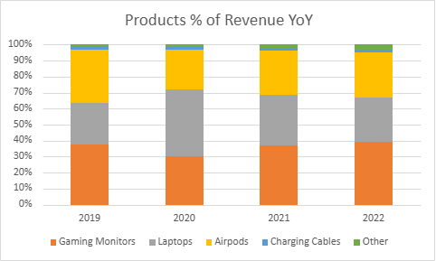
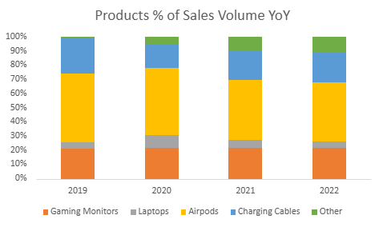

# NexTech Direct Analysis
## Client Background
NexTech Direct is a US-based e-commerce retailer that specializes in consumer electronics. Operating across multiple major regions globally, the company sells a variety of popular electronics, while running a loyalty program aimed at driving repeat purchases and long-term customer retention. This analysis will be covering NexTech Direct’s underutilized data of sales performance, refund trends, and loyalty program effectiveness from 2019 to 2022.

## Business Questions
**What were the overall trends in sales from 2019-2022?**
- What were the monthly and yearly order counts, AOV, and total revenue throughout this period?
- How did sales performance differ by month and region? and any seasonality?
- Which products performed the best and worst?

**Should NexTech continue investing in its loyalty program?**
- Did loyalty members generate higher AOV compared to non-members?
- Did loyalty members order more frequently?
- How was loyalty membership distributed across regions and products?
- What was the refund behavior of loyalty members vs. non-members

**What were the refund trends across Apple products?**
- What were the overall refund rates and refund counts for Apple products?
- How did AOV compare across individual Apple products?
- Did refund behavior change year over year?

## Key Insights
### Overview
From 2019-2022, just over 108k total sales converted into $28M in gross revenue over this 4-year timespan. A key year was 2020, when a spike in sales led to a 160% increase in revenue year-over-year and a 2x growth in sales volume, driven by increased online consumer demand amidst the COVID-19 pandemic. However, this momentum proved to be unsustainable through 2021-2022 with key metrics showing decreases year-over-year: total revenue by 46%, order volume 40%, and average order value (AOV) by 10%. While this decline can be linked to society slowly coming out of lockdown, the next sections will be diving into other contributing factors and point out potential areas that could be improved upon.

  

### Seasonality and Geography

### Product Impact

  
  

## Loyalty Program
### Sales
### Loyalty Refunds

## Refunds Rates

## ERD

