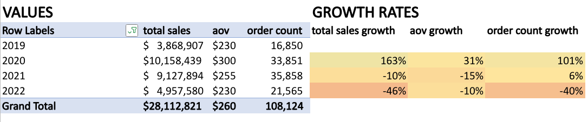
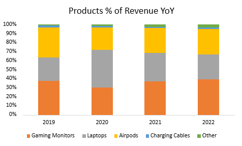
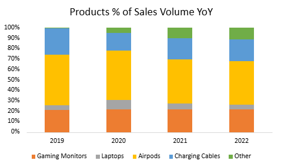

# NexTech Direct Analysis
## Client Background
NexTech Direct is a US-based e-commerce retailer that specializes in consumer electronics. Operating across multiple major regions globally, the company sells a variety of popular electronics, while running a loyalty program aimed at driving repeat purchases and long-term customer retention. This analysis will be covering NexTech Direct’s underutilized data of sales performance, refund trends, and loyalty program effectiveness from 2019 to 2022.

## Business Questions
**What were the overall trends in sales from 2019-2022?**
- What were the monthly and yearly order counts, AOV, and total revenue throughout this period?
- How did sales performance differ by month and region? and any seasonality?
- Which products performed the best and worst?

**Should NexTech continue investing in its loyalty program?**
- Did loyalty members generate higher AOV compared to non-members?
- Did loyalty members order more frequently?
- How did loyalty membership and its revenue share evolve between 2019 and 2022?
- How was loyalty membership distributed across regions and products?
- What was the refund behavior of loyalty members vs. non-members

**What were the refund trends across Apple products?**
- What were the overall refund rates and refund counts for Apple products?
- How did AOV compare across individual Apple products?
- Did refund behavior change year over year?

## Key Insights
### Overview
From 2019-2022, just over 108k total orders generated $28M in gross revenue over this 4-year timespan. A key year was 2020, when a spike in sales led to a 160% increase in revenue year-over-year and a 2x growth in order volume, driven by increased online consumer demand amidst the COVID-19 pandemic. However, this momentum proved to be unsustainable through 2021-2022 with key metrics showing decreases year-over-year: total revenue by 46%, order volume 40%, and average order value (AOV) by 10%. While this decline can be linked to society slowly coming out of lockdown, the next sections will be diving into other contributing factors and point out potential areas that could be improved upon.

  

### Seasonality and Geography

### Product Trends
The company's catalog was anchored by 4 primary products: Gaming Monitors, Laptops, AirPods, and Charging Cables, which together accounted for over 97% of the revenue and over 89% of the order volume across all 4 years. A clear revenue-volume disconnect emerged between Laptops and Charging Cables specifically, as the Laptops consistently contributed a disproportionately high share of revenue (26-42%) relative to their order volume (4-9%), reflecting their high price point and positioning them as a low-frequency, high-AOV product. On the other hard, Charging Cables showed the opposite pattern with a notably higher share of order volume (17-26%) than revenue (1-3%), marking them as a high-frequency, lower-AOV product. Gaming Monitors and AirPods kept a steady and consistent contributors in both areas throughout the timeframe, while the Other category saw gradual uptick in revenue and volume by 2022, hinting at a slow shift towards the less mainstream products.

  
  

## Loyalty Program
### Member Value
Across all 3 core sales metrics: average overder value (AOV), total revenue, and order volume, loyalty member show a clear and accelerating value advantage over the period of 2019-2022.

  

In 2019, loyalty membership had very minimal effects as they represented only 2K orders and $415K in total revenue. This being compared to their non-loyalty counterparts with 14.8K orders and $3.45M, even outpacing AOV with $233 (non-members) versus $207 (members). As expected, the program started off small and its members were not yet outspending the broader customer base.

  

By 2021, the program had enough time to scale, with second-order effects beginning to emerge. Loyalty revenue ($4.87M) surpassed non-loyalty revenue ($4.26M) for the first time, and order volume followed the same trend with 19.5K member orders versus 16.3K non-member. This crossover across revenue and volumes signals that the program reached a meaningful inflection point, shifting loyalty members from a small minority to a dominant contributor of NexTech Direct's sales. 

  

The AOV trajectory reinforces this narrative, non-loyalty AOV peaked in 2020 at $345 before declining to $214 by 2022, while loyalty AOV grew steadily from $207 to $249 before settling at $245 in 2022, finally surpassing non-loyalty for the first time. All core metrics show that members are not only ordering more frequently, but they are even spending more per order.

### Program Growth & Distribution

  

  

  

### Refund Behavior

## Refunds Rates

## ERD

